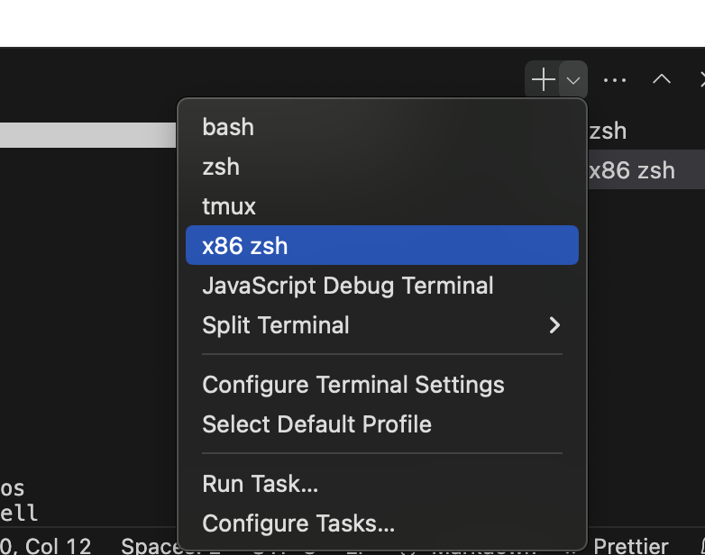
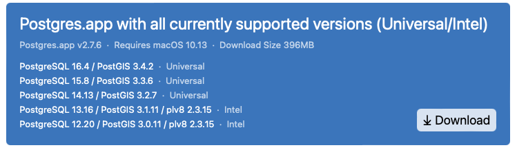
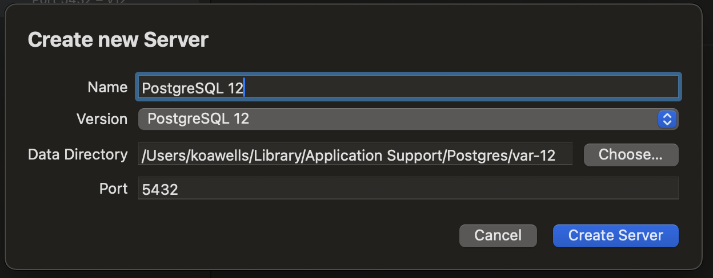
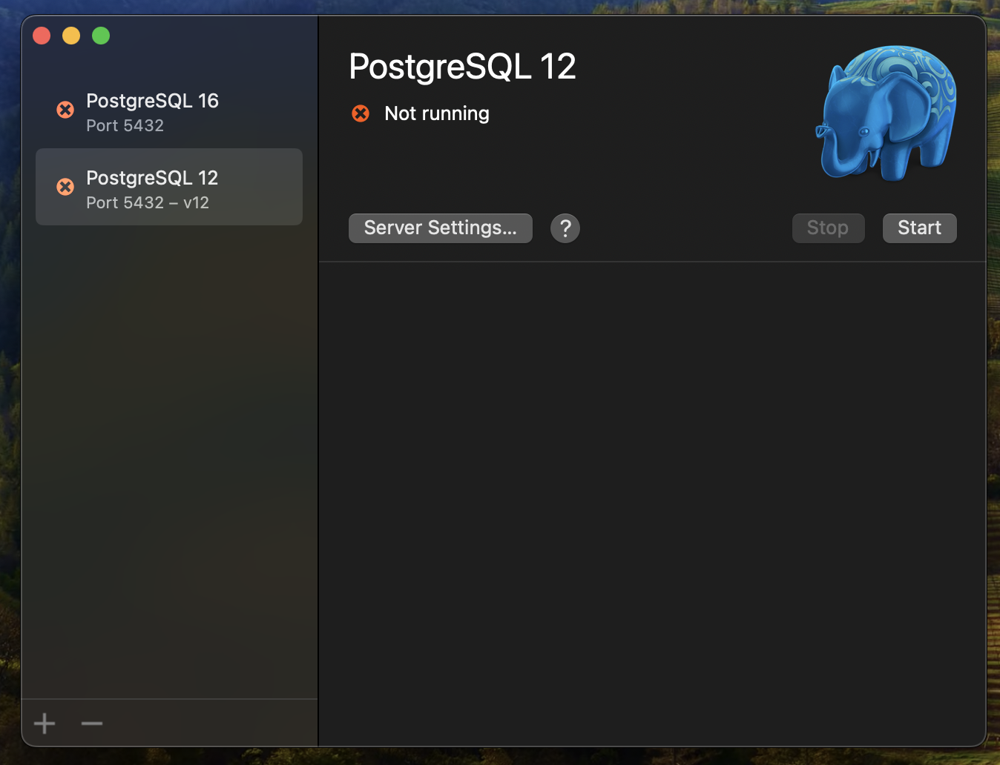
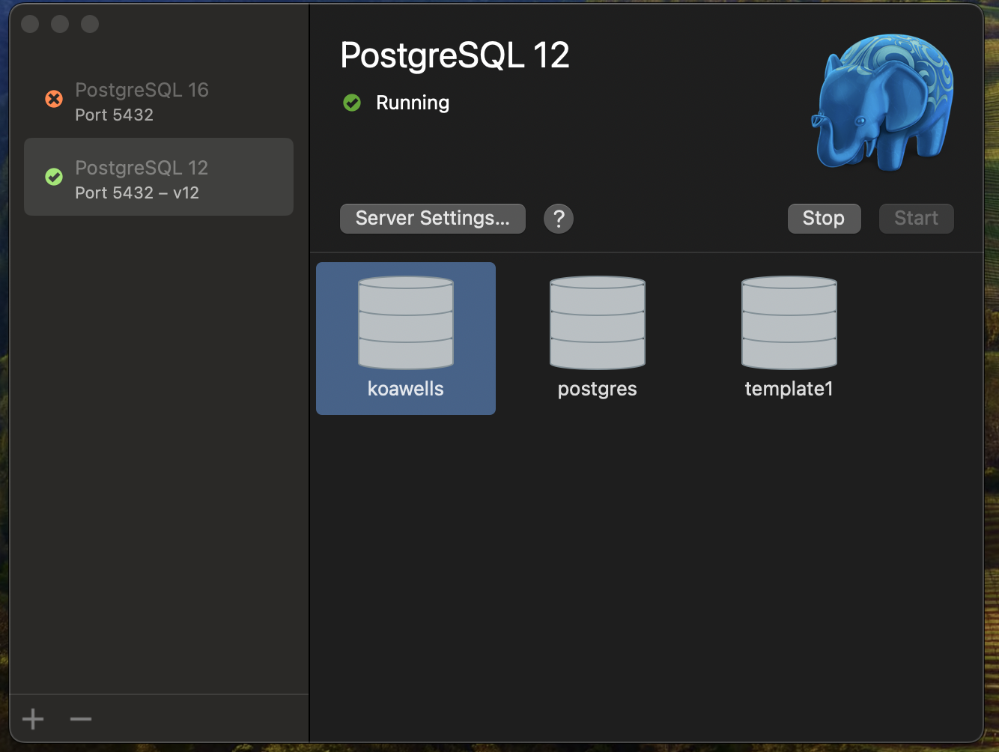

# Setting up a local development environment

### WARNING: Setup document suitable for development environment, not production server

This document is intended to guide you through setting up a local development environment for the Colouring Cities application. This guide works for Apple Silicon devices without a virtual machine.

#### Note

This guide assumes you are working with the ['colouring-core'](https://github.com/colouring-cities/colouring-core) repository. If you are creating your own fork, or want to use a custom city name, then you may wish to change `'colouring-core'` to `'colouring-[your city name]'`.

## Contents

- [:tulip: Installing the tools and components](#tulip-installing-the-tools-and-components)
  - [:computer: Installing Visual Studio Code](#computer-installing-visual-studio-code)
  - [:beer: Install Homebrew](#beer-install-homebrew)
  - [:red_circle: Installing PostgreSQL](#red_circle-installing-postgresql)
  - [:large_blue_circle: Configuring PostgreSQL](#large_blue_circle-configuring-postgresql)
  - [:space_invader: Create an empty database](#space_invader-create-an-empty-database)
  - [:arrow_down: Installing Node.js using NVM](#arrow_down-installing-nodejs-using-nvm)
  - [:snake: Set up Python](#snake-set-up-python)
  - [:rainbow: Installing Colouring Cities Core Platform](#rainbow-installing-colouring-cities-core-platform)
  - [:house: Loading the building data](#house-loading-the-building-data)
  - [:rainbow: Installing Colouring Cities Core Platform](#rainbow-installing-colouring-cities-core-platform)
  - [:computer: Running the application](#computer-running-the-application)
  - [:eyes: Viewing the application](#eyes-viewing-the-application)

## :tulip: Installing the tools and components

### :computer: Installing Visual Studio Code

1. Download Visual Studio Code from the [official Visual Studio Code website](https://code.visualstudio.com/docs/setup/mac).

Configure a terminal inside Visual Studio Code that uses Rosetta so the Coloring Core application can be run with the x86
(i386) architecture.

2. Inside of Visual Studio Code open settings by going to **Code -> Settings -> Settings** in the menu bar

3. In the search bar type

```bash
terminal.int segrated.profiles.osx
```

4. Click **edit in settings.json**. This will create the settings.json file if it is not created and add the initial terminal integrated profiles.

5. At the end of profiles list, add the "x86 zsh" section. Make sure to save the file otherwise it will not appear in the terminal list.

```bash
    "pwsh": {
      "path": "pwsh",
      "icon": "terminal-powershell"
    },
    "x86 zsh": {
      "path": "/usr/bin/arch",
      "args": ["-arch", "x86_64", "/bin/zsh"],
      "overrideName": true
    }
```

The new x86 terminal can be accessed by pressing the arrow next to the + icon above the active terminal


6. Verify that the terminal is using Rosetta. The value should be i386.

```bash
arch
```

**Note:** :exclamation: The x86 terminal is _**only**_ required for the <u>installation of Node</u> and for <u>running the Colouring Cities application</u>. Please use a normal arm64 terminal for the rest of the installation.

### :beer: Install Homebrew

1. The Homebrew installer can be run using curl

```bash
/bin/bash -c "$(curl -fsSL https://raw.githubusercontent.com/Homebrew/install/HEAD/install.sh)"
```

2. Add the homebrew executable path to the top of ~/.zshrc

```bash
export PATH="$PATH:/opt/homebrew/bin/"
```

3. source .zshrc so the terminal can access homebrew

```bash
source ~/.zshrc
```

4. Verify the homebrew installation

```bash
brew --version
```

5. Install prerequisites for the ETL scripts using Homebrew

```bash
brew install parallel
brew install findutils
brew install gnu-sed
```

### :red_circle: Installing PostgreSQL

1. Download PostgreSQL with all currently supported versions from [Postgres.app](https://postgresapp.com/downloads.html). Postgres.app comes with postgis by default so it does not need to be installed separately.



2. Open PostgreSQL then select the + button in the bottom left to create a new server. Enter PostgreSQL 12 as the name and select version PostgreSQL 12. Click Create Server to create the server.



3. On the list of servers on the left, select PostgreSQL 12.



4. Click the "Start" button to start the server.



5. Add the psql executable path to the top of ~/.zshrc

```bash
export PATH="$PATH:/Applications/Postgres.app/Contents/Versions/12/bin"
```

6. Source .zshrc and verify PostgreSQL installation

```bash
source ~/.zshrc
psql --version
```

7. Ensure the `en_US` locale exists.

```bash
locale
```

### :large_blue_circle: Configuring PostgreSQL

Now we configure postgres.

1. Open psql

```bash
psql -U <currently_logged_in_mac_username> postgres
```

2. Set a password for the current user in postgres

```bash
ALTER USER <currently_logged_in_mac_username> PASSWORD '<password>';
```

3. Quit psql

```bash
\q
```

<details>
<summary>Note for "Colouring Cities" devs</summary><p></p>

If you intend to load the full CL database from a dump file into your dev environment, run the above `psql` command with `<currently_logged_in_mac_username>` as "cldbadmin" and use that username in subsequent steps, but also run the above a second time with `<currently_logged_in_mac_username>` as "clwebapp" (see section [:house: Loading the building data](#house-loading-the-building-data) for more details).

</details><p></p>

### :space_invader: Create an empty database

1. Set environment variables, which will simplify running subsequent `psql` commands.

```bash
export PGPASSWORD=<pgpassword>
export PGUSER=<currently_logged_in_mac_username>
export PGHOST=localhost
export PGDATABASE=<colouringcitiesdb>
```

2. Now create an empty database configured with geo-spatial tools. The database name (`<colouringcitiesdb>`) is arbitrary. Create the Colouring Cities database.

```bash
sudo -u $PGUSER psql -c "SELECT 1 FROM pg_database WHERE datname = '$PGDATABASE';" | grep -q 1 || sudo -u $PGUSER createdb -E UTF8 -T template0 --locale=en_US.UTF-8 -O $PGUSER $PGDATABASE
```

3. Install necessary PostgreSQL extensions

```bash
psql -c "create extension postgis;"
psql -c "create extension pgcrypto;"
psql -c "create extension pg_trgm;"
```

### :arrow_down: Installing Node.js using NVM

1. Install NVM using curl

```bash
curl -o- https://raw.githubusercontent.com/nvm-sh/nvm/v0.40.0/install.sh | bash
```

2. Open .zshrc with nano

```bash
nano ~/.zshrc
```

3. Add the following lines to the end of .zshrc

```bash
export NVM_DIR="$([ -z "${XDG_CONFIG_HOME-}" ] && printf %s "${HOME}/.nvm" || printf %s "${XDG_CONFIG_HOME}/nvm")"
[ -s "$NVM_DIR/nvm.sh" ] && \. "$NVM_DIR/nvm.sh" # This loads nvm
```

4. Source .zshrc so terminal can access nvm

```bash
source ~/.zshrc
```

5. Open a new x86 terminal in VSCode. Inside of the new terminal, install Node v16.13.2

```bash
nvm install v16.13.2
```

6. Verify that the correct Node version is selected

```bash
node --version
```

7. You can also verify that x86 Node was installed

```bash
node -e 'console.log(process.arch)'
```

This should return **x64**

8. Create an alias to distinguish the x86 version of Node from the arm64 versions

```bash
nvm alias x86-16 v16.13.2
```

9. To activate the x86 version, you can select it with nvm

```bash
nvm use x86-16
```

### :snake: Set up Python

1. Install the latest version of python from the [official python website](https://www.python.org/downloads/macos/)

**Note:** This will install python so it is accessible via python3 and pip3 in the command line. If you prefer to use the python and pip commands, you must add them as aliases to .zshrc. The following steps will assume that you have made this change.

2. Open .zshrc with nano

```bash
nano ~/.zshrc
```

3. Add the python and pip alias to the top of .zshrc

```bash
alias python='/Library/Frameworks/Python.framework/Versions/3.12/bin/python3'
alias pip='/Library/Frameworks/Python.framework/Versions/3.12/bin/pip3'
```

4. Source .zshrc to activate the new aliases

```bash
source ~/.zshrc
```

5. Verify the python and pip alias

```bash
which python
which pip
```

6. Install pyvenv to create a colouring-cities virtual environment

```bash
pip install virtualenv
```

### :rainbow: Installing Colouring Cities Core Platform

1. Clone the `colouring-core` codebase.

```bash
cd ~ && git clone https://github.com/colouring-cities/colouring-core.git
```

2. Go into the app directory of the colouring-core repository

```bash
cd ~/colouring-core/app
```

**Note:** We assume here that you will clone the repo into your home directory. Watch out for later commands in this guide that assume the repo is located at `~/colouring-core` and modify the path if appropriate.

3. Install required node packages

```bash
npm install
```

## :house: Loading the building data

There are several ways to create the Colouring Cities database in your environment. The simplest way if you are just trying out the application would be to use test data from OSM, but otherwise you should follow one of the instructions below to create the full database either from scratch, or from a previously made db (via a dump file).

To create the full database from scratch, follow [these instructions](../etl/README.md), otherwise choose one of the following:

<details>
<summary> Create database from dump </summary><p></p>

If you are a developer on the Colouring London project (or another Colouring Cities project), you may have a production database (or staging etc) that you wish to duplicate in your development environment.

Log into the environment where your production database is kept and create a dump file from the db.

```bash
pg_dump <colouringcitiesdb> > <dumpfile>
```

You should then download the file to the machine where you are setting up your development environment. If you are using Virtualbox, you could host share the dump file with the VM via a shared folder (e.g. [see these instructions for Mac](https://medium.com/macoclock/share-folder-between-macos-and-ubuntu-4ce84fb5c1ad)).

In your Ubuntu installation where you have been running these setup steps (e.g. Virtualbox VM), you can then recrate the db like so.

```bash
psql < <dumpfile>
```

Alternatively, if you get errors using the above command, use pg_restore:

```bash
pg_restore -d <colouringcitiesdb> <dumpfile>
```

#### Run migrations

Now run all 'up' migrations to create tables, data types, indexes etc. The `.sql` scripts to
do this are located in the `migrations` folder of your local repository.

```bash
ls ~/colouring-core/migrations/*.up.sql 2>/dev/null | while read -r migration; do psql < $migration; done;
```

Again, if you get errors, you may need to manually specify the database name

```bash
ls ~/colouring-core/migrations/*.up.sql 2>/dev/null | while read -r migration; do psql -d <colouringcitiesdb> < $migration; done;
```

</details>

<details>
<summary> Create database with test data </summary><p></p>

This section shows how to load test buildings into the application from OpenStreetMaps (OSM).

#### Load OpenStreetMap test polygons

Create a virtual environment for python in the `etl` folder of your repository. In the following example we have name the virtual environment _colouringcities_ but it can have any name.

```bash
cd ~/colouring-core/etl
python -m venv colouringcities
```

Activate the virtual environment so we can install python packages into it.

```bash
source colouringcities/bin/activate
```

Install python pip package manager and related tools.

```bash
pip install --upgrade pip
pip install --upgrade setuptools wheel
```

Install the required python packages.

```bash
pip install -r requirements.txt
```

To help test the Colouring Cities application, `get_test_polygons.py` will attempt to save a small (1.5km²) extract from OpenStreetMap to a format suitable for loading to the database.

**NOTE:** You can edit the file by [changing this line](https://github.com/colouring-cities/colouring-core/blob/df651521983665056d442603a329a37d966aede1/etl/get_test_polygons.py#L22) to specify the latitude and longitude used to define the centre of the sample data area, as well as the distance from that point, which are used to generate the sample data. (i.e. you could change it to match the cc-config.json file - as discussed in [configuring-colouring-cities.md](https://github.com/colouring-cities/colouring-core/blob/master/docs/configuring-colouring-cities.md).

Download the test data.

```bash
python get_test_polygons.py
```

Note: the first time you run it, you will get these warnings:

```
rm: cannot remove 'test_buildings.geojson': No such file or directory
rm: cannot remove 'test_buildings.3857.csv': No such file or directory
```

#### Run migrations

Now run all 'up' migrations to create tables, data types, indexes etc. The `.sql` scripts to
do this are located in the `migrations` folder of your local repository.

```bash
ls ~/colouring-core/migrations/*.up.sql 2>/dev/null | while read -r migration; do psql < $migration; done;
```

#### Load buildings

Load all building outlines.

```bash
./load_geometries.sh ./
```

Create a building record per outline.

```bash
./create_building_records.sh
```

</details>

After buildings are loaded or their geometries changed, it is necessary to flush cache files so outdated geometries are not shown.
This can be achieved by deleting relevant folder at the server.

## :computer: Running the application

Now we are ready to run the application.

1. First enter the app directory.

```bash
cd ~/colouring-core/app
```

2. Then create a folder for the tilecache.

```bash
mkdir tilecache
```

3. Create some additional variables for running the application (the `APP_COOKIE_SECRET` is arbitrary).

```bash
export PGPORT=5432
export APP_COOKIE_SECRET=123456
export TILECACHE_PATH=~/colouring-core/app/tilecache
```

4. Finally, simply run the application with npm.

```bash
npm start
```

**Note:** You can also specify the variables for `npm start` like so:

<details>
<summary>
Specify variables
</summary>

```bash
PGPASSWORD=<pgpassword> PGDATABASE=<colouringcitiesdb> PGUSER=<username> PGHOST=localhost PGPORT=5432 APP_COOKIE_SECRET=123456 TILECACHE_PATH=~/colouring-core/app/tilecache npm start
```

</details><p></p>

### :eyes: Viewing the application

The site can then be viewed on http://localhost:3000 in the browser on the host computer.

Finally to quit the application type `Ctrl-C`.
