# Setting up a Hyper-V Virtual Machine

#### Prerequisites

This guide is written for Hyper-V running on MS Windows Server, in this case Windows Server Datacenter 2019.

---

#### Create a Hyper V VM

Launch the Hyper V Manager app and select 'New' -> 'Virtual Machine...' option (as shown below)

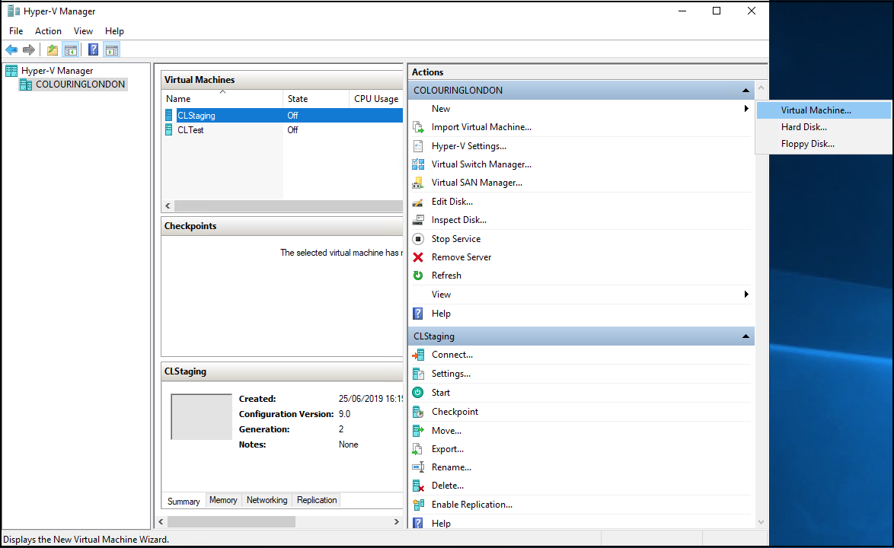

---

You will be presented with the first Wizard screen. Select 'Next' for a custom installation (as shown below)

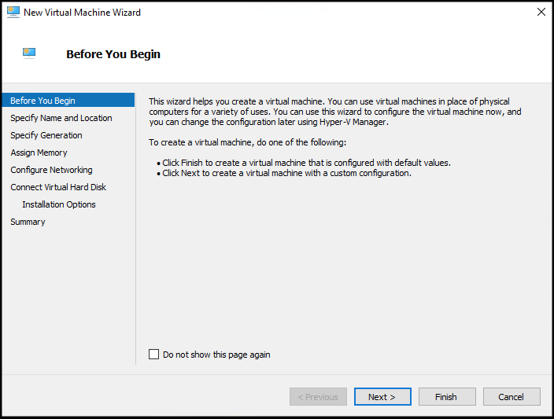

---

At the next screen specify the name and location for the VM . In this example we have used a dedicated directory for our VMs (see below).

---

At the next screen specify the Generation. As this is not a legacy application we can choose the latest generation (see below).

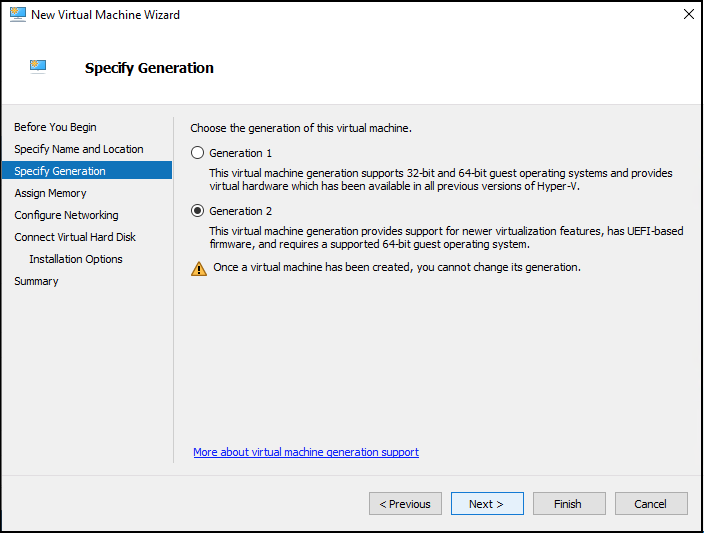

---

At the next screen assign the amount of RAM to allocate to the VM. This value can be changed later, so the value is not critical but the final value chosen is obviously dependent on the available machine RAM (see below).

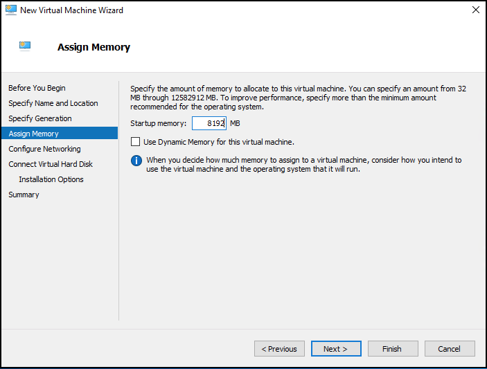

---

At the next screen configure the network adapter. This will typically be a Ethernet - Virtual Switch, but the actual name will be hardware dependent (see below).

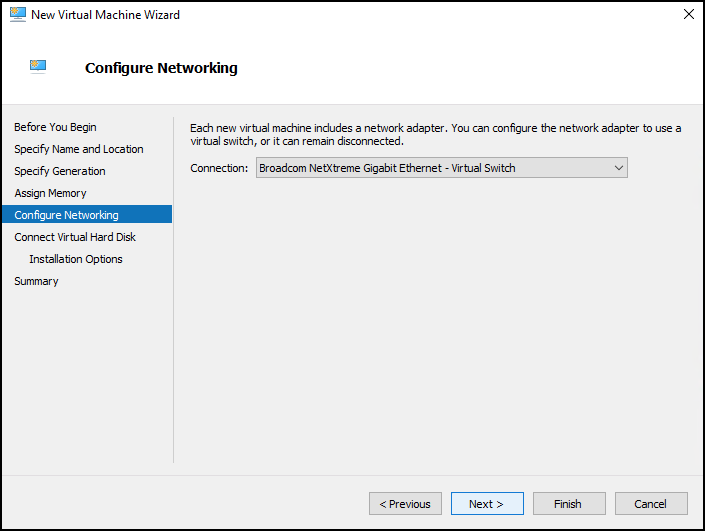

---

At the next screen configure the virtual hard disk. It makes sense to create a dedicated virtual hard disk and to store it in a sensible location. The size chosen *is important* as (unlike the RAM value) it is not trivial to change this later (see diagram below).

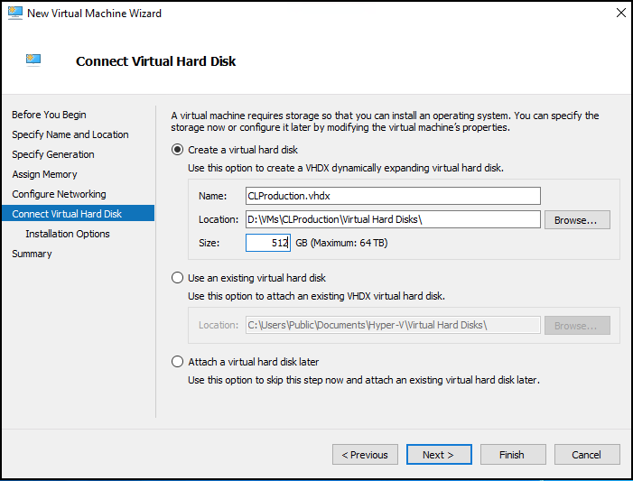

---

Finally, at the next screen choose the 'Install an operating system later' option and select the '**Finish**' button

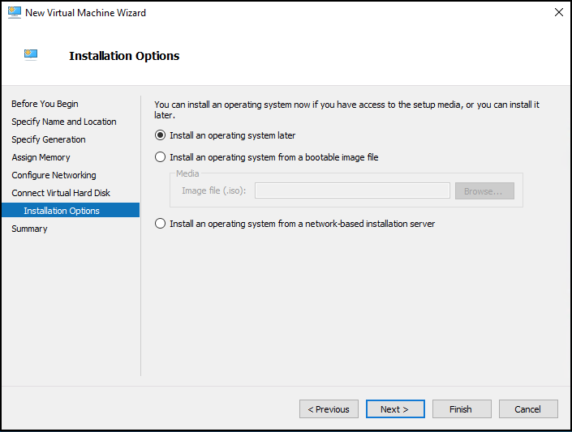

---

The newly created VM should now show up in the Hyper-V Manager's list of VMs (see below)

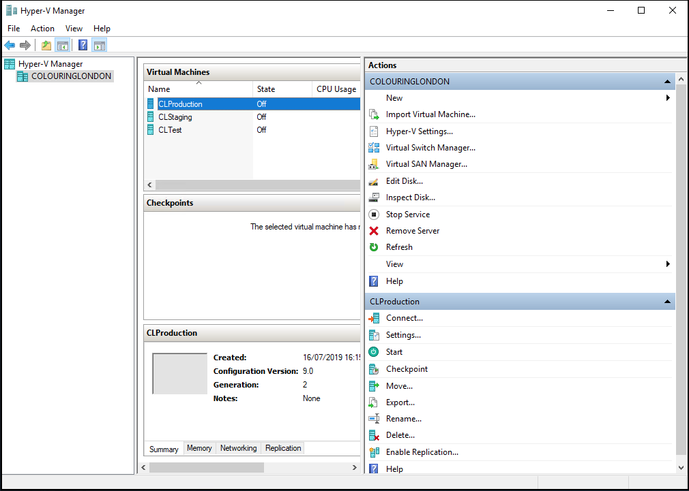

---

#### Installing Ubuntu

Prepare a suitable bootable media file. For this application we will need an `Ubuntu_18.04_server_amd64.iso` file. This could be hosted on a USB drive or copied over to a suitable location on the Windows Server file system.

In Hyper-V Manager, from the list of VMs, right click on the new created VM and select the 'Settings' option as shown below.

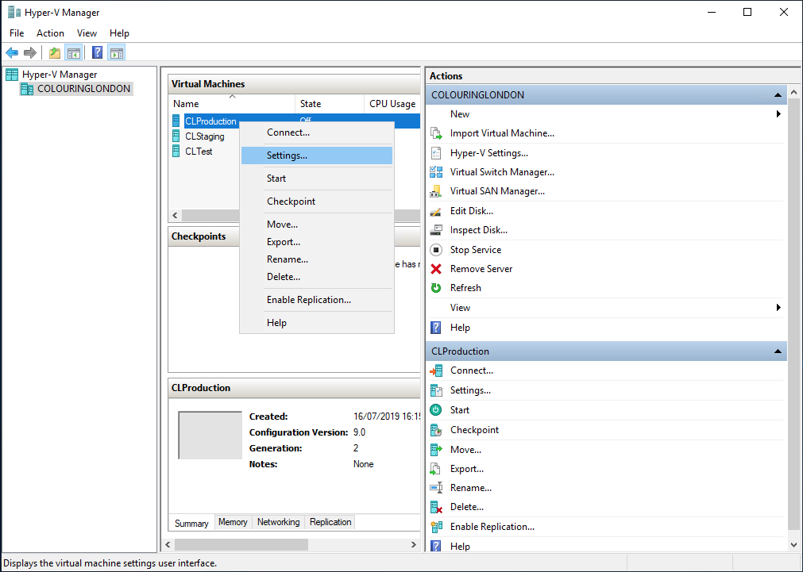

---

From the Settings screen select 'Security' in the left hand panel. In the right hand panel uncheck the 'Enable Secure Boot' checkbox as we are not booting into Windows. Click the 'Apply'.

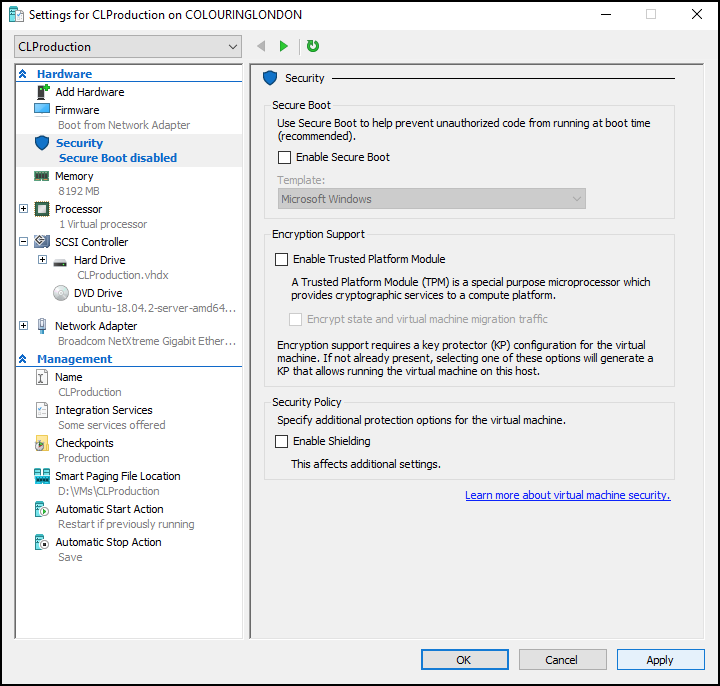

---

From the Settings screen select 'SCSI Controller' in the left hand panel. In the right hand panel select 'DVD' and select the 'Add' button (as shown below).

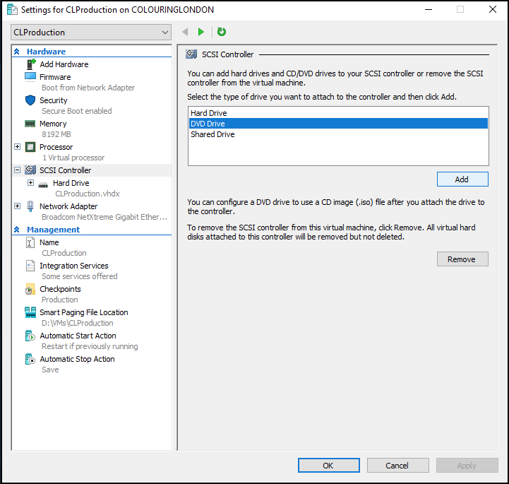

---

Now select the 'Image file' radio button and browse to the location of the ISO file. Now click the 'Apply' button.

---

From the Settings screen select 'Firmware' in the left hand panel, then in the right hand panel use the 'Move Up' button to move the 'DVD Drive' hosting the ISO up to the top of the list so that it is the first boot entry. Now click the 'Apply' button and then the 'OK' button to finish the boot set up.

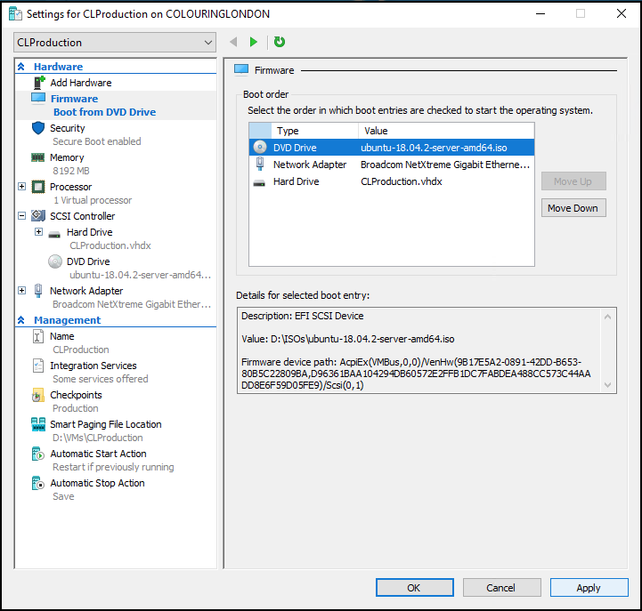

---

You can now start the newly created VM which should boot off the ISO file to enable you to install Ubuntu in the normal manner.

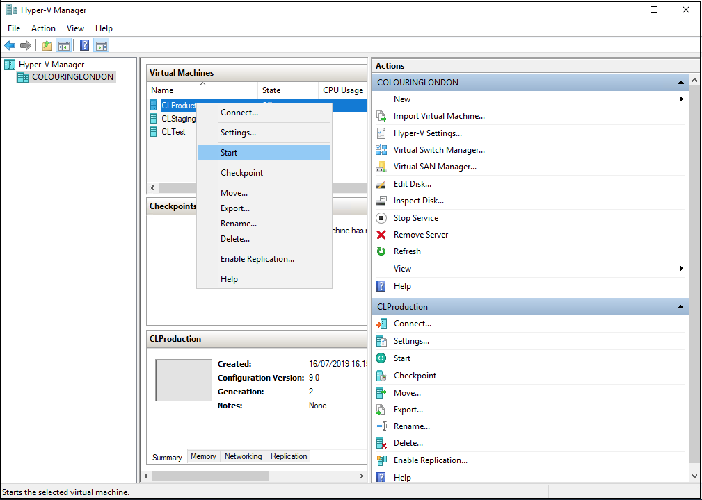

---

