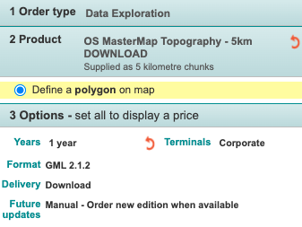

# Creating a Colouring London database from scratch

## Data downloading

The scripts in this directory are used to extract, transform and load (ETL) the core datasets
for Colouring London:

Building geometries, sourced from Ordnance Survey (OS) MasterMap (Topography Layer)
<!-- 1. Unique Property Reference Numbers (UPRNs), sourced from Ordnance Survey AddressBase -->

To get the required datasets, you'll need to complete the following steps:

1. Sign up for the Ordnance Survey [Data Exploration License](https://www.ordnancesurvey.co.uk/business-government/licensing-agreements/data-exploration-sign-up). You should receive an e-mail with a link to log in to the platform (this could take  up to a week).
2. Navigate to https://orders.ordnancesurvey.co.uk/orders and click the button for: ✏️ Order. From here you should be able to click another button to add a product.
3. Drop a rectangle or Polygon over London and make the following selections, clicking the "Add to basket" button for each:


<p></p>

<!--  -->

4. You should be then able to check out your basket and download the files. Note: there may be multiple `.zip` files to download for MasterMap due to the size of the dataset.
<!-- 5. Unzip the AddressBase `.zip` in a convenient location. We will use the unzipped folder in later steps. Rename the folder as appropriate (make sure this folder doesn't contain the original `.zip` file). Note: this folder also contains `.zip` files, do not unzip at this stage as a script will do this later. -->
6. Unzip the MasterMap `.zip` files and move all the `.gz` files from each to a single folder in a convenient location. We will use this folder in later steps.

## Prerequisites

You should already have set up PostgreSQL and created a database. Make sure to create environment variables to use `psql` if you haven't already:

```bash
export PGPASSWORD=<pgpassword>
export PGUSER=<username>
export PGHOST=localhost
export PGDATABASE=<colouringlondondb>
```

Create the core database tables:

```bash
cd ~/colouring-london
psql < migrations/001.core.up.sql
```

There is some performance benefit to creating indexes after bulk loading data.
Otherwise, it's fine to run all the migrations at this point and skip the index
creation steps below.

Install GNU parallel, this is used to speed up loading bulk data.

## Make data available to Ubuntu

If you didn't download the OS files to the Ubuntu machine where you are setting up your Colouring London application, you will need to make them available there. If you are using Virtualbox, you could host share a the folder containing the MasteerMap files with the VM via a shared folder (e.g. [see these instructions for Mac](https://medium.com/macoclock/share-folder-between-macos-and-ubuntu-4ce84fb5c1ad)).

## Process and load Ordnance Survey data

Move into the `etl` directory and set execute permission on all scripts.

```bash
cd ~/colouring-london/etl
chmod +x *.sh
```

<!-- Extract the addressBase dataset.

```bash
./extract_addressbase.sh ./addressbase_dir
``` -->

<!-- ERROR 1: Couldn't fetch requested layer 'BasicLandPropertyUnit'! -->

Extract the MasterMap data (this step could take a while).

```bash
./extract_mastermap.sh ./mastermap_dir
```

<!-- Didn't throw an error - did Ctrl-C after an hour -->

Ensure you have the `colouringlondon` environment activated.

```bash
source colouringlondon/bin/activate
```

Filter MasterMap 'building' polygons and any others referenced by addressbase.

```bash
./filter_transform_mastermap_for_loading.sh ./mastermap_dir
```

Load all building outlines.

<!-- I had to edit the below file to set the psql vars before running -->

```bash
./load_geometries.sh ./mastermap_dir
```

Index geometries.

```bash
psql < ../migrations/002.index-geometries.up.sql
```

Create a building record per outline.

<!-- I had to edit the below file to set the psql vars before running -->

```bash
./create_building_records.sh
```

<!-- Insert 0.... -->

Add UPRNs where they match.

<!-- I had to edit the below file to set the psql vars before running -->

```bash
./load_uprns.sh ./addressbase_dir
````

Run the remaining migrations in `../migrations` to create the rest of the database structure.

```bash
ls ~/colouring-london/migrations/*.up.sql 2>/dev/null | while read -r migration; do psql < $migration; done;
```

# [WIP] Updating the Colouring London database with new OS data

TODO: this section should instruct how to update and existing db